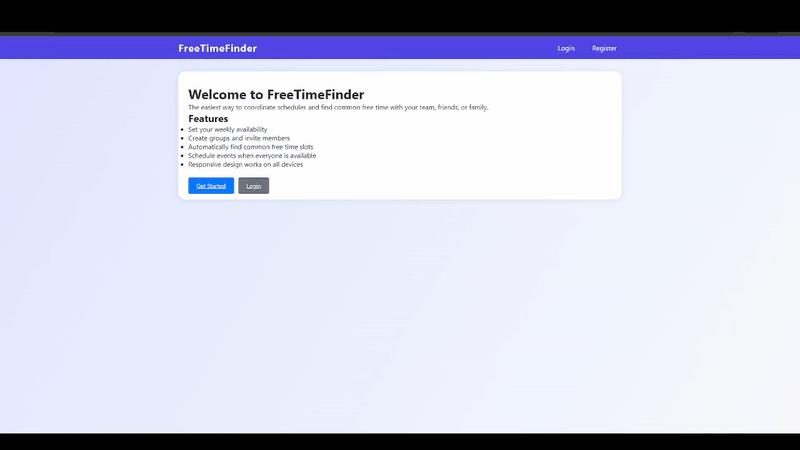

# FreeTimeFinder

FreeTimeFinder is a full-stack web application for schedule coordination. It allows users to register, set their weekly availability, create groups/events, and automatically find common free time slots. All containerized in a single Docker image for easy deployment.

## Demo




## Features
- User registration and authentication
- Weekly availability scheduling
- Group/event creation and management
- Automatic calculation of common available time slots
- Calendar visualization

## Quick Start

### Prerequisites
- [Docker](https://www.docker.com/products/docker-desktop) installed
- (Optional) [Docker Compose](https://docs.docker.com/compose/) if you want to use the provided compose file

### 1. Pull the Docker image
```
docker pull canel1125/freetimefinder-all
```

### 2. Run with Docker Compose
Create a `docker-compose.yml` like this (or use the one provided):
```yaml
version: '3.8'
services:
  freetimefinder:
    image: canel1125/freetimefinder-all
    container_name: freetimefinder_all
    ports:
      - "8000:8000"
      - "3000:3000"
    environment:
      - DEBUG=1
      - DJANGO_SECRET_KEY=your-secret-key-change-in-production
      - ALLOWED_HOSTS=localhost,127.0.0.1
      - CORS_ALLOWED_ORIGINS=http://localhost:3000,http://127.0.0.1:3000
      - REACT_APP_API_URL=http://localhost:8000/api
    volumes:
      - sqlite_data:/app/backend/db
    networks:
      - freetimefinder_network
volumes:
  sqlite_data:
networks:
  freetimefinder_network:
    driver: bridge
```

Then run:
```
docker-compose up -d
```

### 3. Access the App
- Frontend: http://localhost:3000
- Backend API: http://localhost:8000


 The SQLite database is persisted in a Docker volume (`sqlite_data`).


---
